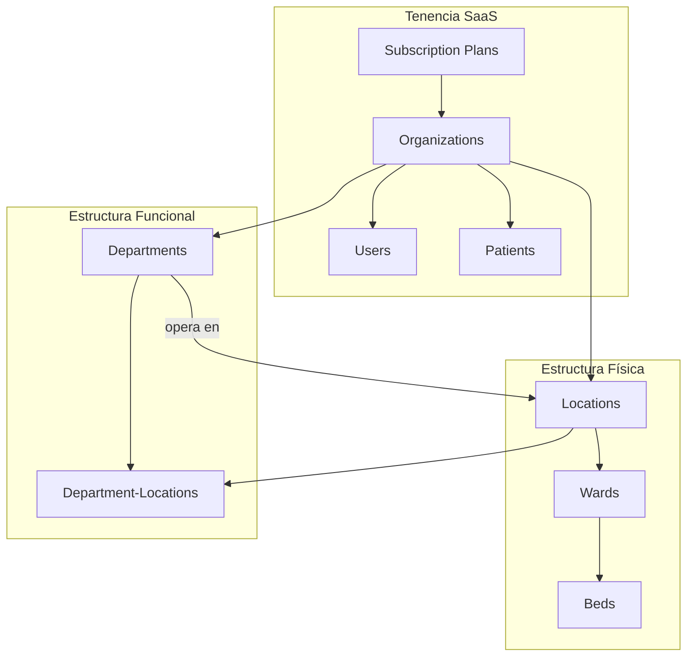
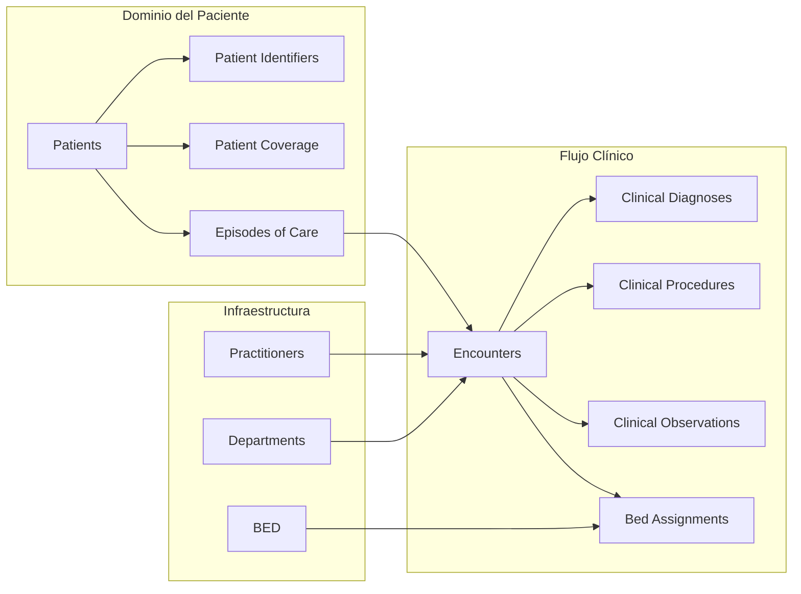
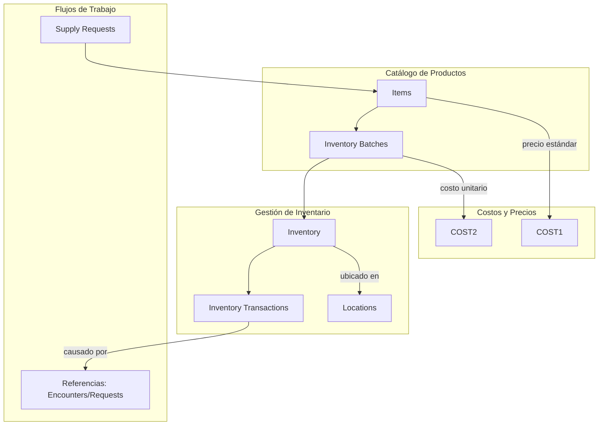
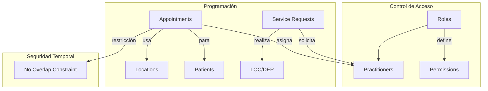

# HealthSaaS - Sistema de Base de Datos para Salud

## Descripción General

HealthSaaS es una base de datos multitenant diseñada para sistemas de información hospitalaria (HIS) y proveedores de servicios de salud. La arquitectura sigue principios de SaaS (Software-as-a-Service) con aislamiento completo de datos por organización, seguridad a nivel de fila (RLS), y soporte para estándares clínicos como FHIR.

## Características Clave

- **Arquitectura Multitenant**: Aislamiento completo de datos por organización
- **Seguridad Avanzada**: Row Level Security (RLS) en todas las tablas críticas
- **Soporte FHIR**: Campos para integración con estándares de interoperabilidad
- **Modelo Jerárquico**: Organización → Ubicaciones → Departamentos
- **Precisión Financiera**: Campos monetarios con 4 decimales
- **Control de Inventario**: Sistema completo de trazabilidad de lotes
- **Programación Inteligente**: Restricciones de no superposición de citas

---

## Diagrama de Arquitectura

### 1. Modelo de Tenencia y Jerarquía Organizacional



### 2. Modelo Clínico y de Pacientes



### 3. Sistema de Inventario y Cadena de Suministro



### 4. Sistema de Programación y Roles



---

## Tablas Principales

### Tablas de Configuración y Tenencia

| Tabla | Descripción | RLS | Clave Única |
|-------|-------------|-----|-------------|
| `subscription_plans` | Planes de suscripción | No | `name` |
| `organizations` | Organizaciones clientes | Sí | - |
| `locations` | Ubicaciones físicas | Sí | - |
| `departments` | Departamentos funcionales | Sí | - |
| `roles` | Roles y permisos | Sí | `(name, organization_id)` |

### Dominio del Paciente

| Tabla | Descripción | RLS | Índices Críticos |
|-------|-------------|-----|------------------|
| `patients` | Pacientes | Sí | `(org, last_name, first_name)`, `date_of_birth` |
| `patient_identifiers` | Identificadores únicos | Sí | `(value, type, org)` |
| `episodes_of_care` | Episodios de atención | Sí | `patient_id` |

### Módulo Clínico

| Tabla | Descripción | RLS | Restricciones |
|-------|-------------|-----|---------------|
| `encounters` | Encuentros clínicos | Sí | `class_code IN (AMB, IMP, EMER...)` |
| `clinical_diagnoses` | Diagnósticos | Sí | - |
| `clinical_procedures` | Procedimientos | Sí | - |
| `clinical_observations` | Observaciones/vitales | Sí | - |

### Gestión de Camas (ADT)

| Tabla | Descripción | RLS | Restricciones Únicas |
|-------|-------------|-----|----------------------|
| `wards` | Salas/habitaciones | Sí* | - |
| `beds` | Camas individuales | Sí* | - |
| `bed_assignments` | Asignación de camas | Sí | EXCLUDE (no double booking) |

### Cadena de Suministro

| Tabla | Descripción | Precisión Decimal | RLS |
|-------|-------------|-------------------|-----|
| `items` | Productos/medicamentos | Precio: 4 decimales | Sí |
| `inventory_batches` | Lotes | Costo: 4 decimales | Sí |
| `inventory` | Existencias | Cantidad: 2 decimales | Sí |
| `inventory_transactions` | Movimientos | Cantidad: 2 decimales | Sí |

### Programación

| Tabla | Descripción | RLS | Restricciones Avanzadas |
|-------|-------------|-----|-------------------------|
| `appointments` | Citas | Sí | EXCLUDE (no practitioner overlap) |
| `service_requests` | Solicitudes de servicio | Sí* | - |

*RLS heredado a través de relaciones

---

## Seguridad y Aislamiento

### Row Level Security (RLS)

Todas las tablas críticas tienen políticas RLS que filtran datos basándose en:
```sql
current_setting('app.current_organization_id')::uuid
```

### Función de Autenticación Segura

```sql
CREATE OR REPLACE FUNCTION public.login_user(p_email TEXT)
RETURNS TABLE(user_id UUID, org_id UUID, password_hash TEXT, role_permissions JSONB)
SECURITY DEFINER
```

Esta función:
- Se ejecuta con privilegios elevados (SECURITY DEFINER)
- Omite RLS para permitir autenticación inicial
- Devuelve solo la información necesaria para login

### Patrones de Denormalización para RLS

Para tablas de unión y transaccionales, se denormaliza `organization_id`:
```sql
-- Ejemplo en clinical_diagnoses
organization_id UUID NOT NULL REFERENCES public.organizations(id)
```

---

## Características Técnicas Avanzadas

### 1. Restricciones de Exclusión (Exclusion Constraints)
```sql
-- Evita superposición de citas para un mismo practicante
CONSTRAINT no_practitioner_overlap EXCLUDE USING gist (
    organization_id WITH =,
    practitioner_id WITH =,
    tstzrange(start_time, end_time) WITH &&
)

-- Evita doble asignación de camas
CONSTRAINT no_double_booking EXCLUDE USING gist (
    bed_id WITH =,
    tstzrange(start_time, end_time) WITH &&
)
```

### 2. Particionamiento de Tablas
```sql
-- Tabla de logs particionada por mes
CREATE TABLE public.audit_logs (...) PARTITION BY RANGE (timestamp);
CREATE TABLE public.audit_logs_y2025m01 PARTITION OF public.audit_logs
    FOR VALUES FROM ('2025-01-01') TO ('2025-02-01');
```

### 3. Precisión Monetaria
- `NUMERIC(14,4)` para costos y precios (4 decimales)
- `NUMERIC(10,2)` para cantidades físicas (2 decimales)

### 4. Índices Optimizados
- Índices compuestos para búsquedas frecuentes
- Índices funcionales para búsqueda case-insensitive
- Índices por rango de fechas para consultas históricas

---

## Convenciones de Nomenclatura

### Prefijos de Índices
- `idx_` para índices regulares
- `pk_` para llaves primarias (implícito en PostgreSQL)
- `fk_` para llaves foráneas (implícito)

### Patrones de Nombres de Columnas
- `_id` para referencias a otras tablas
- `_at` para timestamps (ej: `created_at`, `updated_at`)
- `is_` para flags booleanos
- `_json` o `_raw` para datos JSON

---

## Consideraciones de Migración/Implementación

### Extensiones Requeridas
```sql
CREATE EXTENSION IF NOT EXISTS "pgcrypto";
CREATE EXTENSION IF NOT EXISTS "btree_gist";
```

### Orden de Creación
1. Extensions
2. Tablas de configuración (`subscription_plans`, `terminology_systems`)
3. Organizaciones y estructura (`organizations`, `locations`, `departments`)
4. Usuarios y roles
5. Dominio del paciente
6. Tablas clínicas
7. Tablas transaccionales
8. Índices y constraints avanzados

### Configuración de Sesión
Antes de cada operación, establecer:
```sql
SET app.current_organization_id = 'org-uuid-here';
```

---

## Modelo de Datos FHIR

### Campos de Integración FHIR
- `fhir_id`: Identificador externo del recurso FHIR
- `fhir_raw`: Recurso FHIR completo en JSONB
- Implementado en: `organizations`, `locations`, `users`, `patients`, `encounters`

### Terminología Estándar
- `terminology_systems`: Sistemas de codificación (LOINC, SNOMED, ICD-10)
- `standard_concepts`: Conceptos normalizados
- Referenciado en: diagnósticos, procedimientos, observaciones

---

## Consideraciones de Escalabilidad

### Estrategias de Particionamiento
1. **Por Organización**: Para tablas muy grandes
2. **Por Tiempo**: Para logs y datos históricos (ya implementado en `audit_logs`)
3. **Por Región Geográfica**: Para organizaciones multi-país

### Patrones de Consulta Optimizados
- Índices compuestos en combinaciones frecuentes (`org_id + fecha`)
- Índices parciales para datos activos (`WHERE is_active = true`)
- Índices en expresiones para búsqueda case-insensitive

---

## Mantenimiento y Operaciones

### Tareas Programadas Recomendadas
1. **Limpieza de datos eliminados**: Borrado físico después de retención
2. **Reindexación**: Para índices de alta modificación
3. **Particionamiento**: Crear nuevas particiones mensuales
4. **Backup incremental**: Basado en particionamiento temporal

### Monitoreo Recomendado
1. Uso de índices (pg_stat_user_indexes)
2. Tamaño de particiones
3. Eficiencia de consultas RLS
4. Contención en restricciones de exclusión

---

## Notas de Implementación

### Para Desarrolladores
- Siempre establecer `app.current_organization_id` en cada sesión
- Usar la función `login_user` para autenticación
- Considerar denormalización para queries frecuentes cruzando organizaciones

### Para Administradores de BD
- Monitorear el uso de extensiones `btree_gist`
- Planificar estrategia de particionamiento para datos clínicos históricos
- Considerar tablespaces separados para datos vs índices

### Para Arquitectos
- El modelo soporta extensión a multi-región
- Posible implementación de sharding por organización
- Compatible con réplicas de lectura para reporting

---

## Licencia y Uso

Este modelo de base de datos está diseñado para sistemas de salud y requiere adaptación a regulaciones locales (HIPAA, GDPR, etc.). Se recomienda revisión legal antes de implementación en producción.

**Última Actualización**: Diciembre 2024  
**Versión del Esquema**: 2.0  
**PostgreSQL Requerido**: 12+ (para particionamiento declarativo)